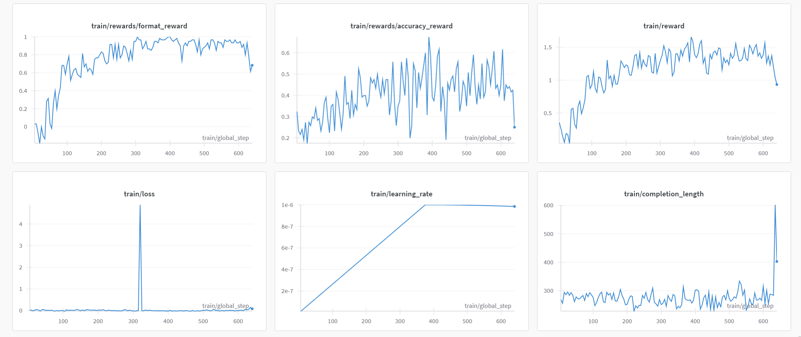

Knowledge-R1 🚀📚🧠

Knowledge-R1 is a framework designed to enhance the synergy between knowledge retrieval and reasoning capabilities. It addresses two fundamental challenges:

Mitigating Knowledge Deficiency 🧐: Large reasoning models often lack sufficient knowledge to make informed decisions.

Enhancing Reasoning in Adaptive Retrieval-Augmented Generation (RAG) Models 🔄📖: Traditional RAG models struggle with complex reasoning to do better query analysis, document analysis, and better retrieval.

Approach 🤖➡️🎯

Knowledge-R1 introduces a novel agentic RAG reinforcement learning (RL) framework that enables multi-turn knowledge interaction. This approach:

🏆 Enhances the model's ability to integrate retrieved knowledge into its reasoning process.

🔄 Facilitates iterative refinement, allowing reasoning models to actively query and adapt retrieved knowledge.

🎯 Optimizes knowledge-reasoning synergy through reinforcement learning.

Method 🏗️📌

The core methodology of Knowledge-R1 involves:

Fast Agentic RAG Framework: Using Batch inference to accelerate agentic RAG.

Multi-Turn Knowledge Interaction 🔄🔍: Enabling stepwise retrieval and reasoning to progressively improve the model’s understanding and decision-making.

Reinforcement Learning Optimization 🎯🔧: Using reinforcement learning techniques to enhance the model's retrieval and reasoning alignment dynamically.

Achievements 🏅

✅ Successfully reproduced results on Qwen-1.5B-Instruct, demonstrating significant improvements in knowledge reasoning tasks.

⚡ Partially implemented on 7B-scale models, though currently facing Out-Of-Memory (OOM) challenges. We are still working on it!😓💾

Experimental Results 📊

For Qwen2.5-1.5B-Instruct:

For Qwen2.5-7B-Instruct:
We have observed that the response length has been continuously increasing. However, as the length increases, we have encountered OOM (Out of Memory) issues. As a result, the training has not yet been completed at the 7B scale. We will continue to optimize.

Here is the part of failed result:

Details 🛠️
We use bm25s as retriever.
We use wiki2018 as retrieval corpus.
We use 2wikimultihopqa as dataset: https://huggingface.co/datasets/hzy/kr1_2wiki.

License 📜
MIT

